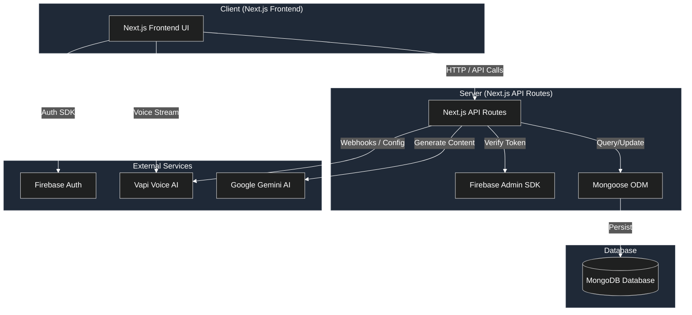
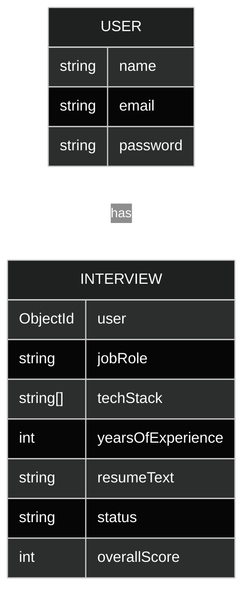
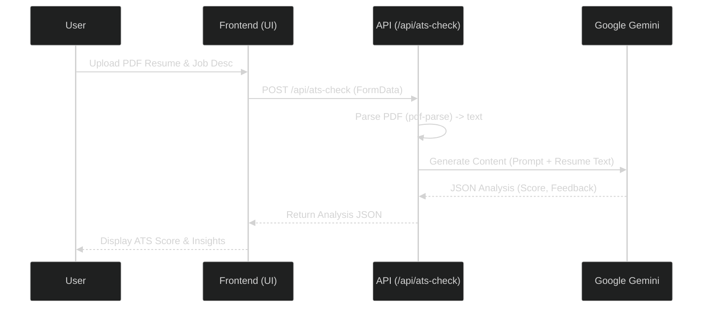
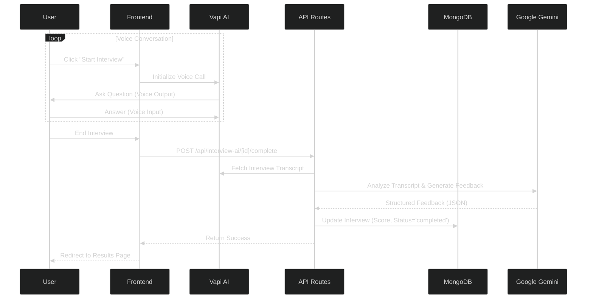

# HireMind Project Report

## 1. Tech Stack

The project utilizes a modern, full-stack JavaScript/TypeScript architecture centered around Next.js.

### Core Framework & Language
- **Framework**: Next.js 15.2.2 (App Router)
- **Language**: TypeScript
- **Runtime**: Node.js

### Frontend & UI
- **Styling**: Tailwind CSS (v4)
- **UI Components**: shadcn/ui (based on Radix UI)
- **Icons**: Lucide React
- **Animations**: tailwindcss-animate, tw-animate-css
- **Forms**: react-hook-form with @hookform/resolvers and zod for validation
- **Notifications**: sonner

### Backend & Database
- **Database**: MongoDB (v7)
- **ORM/ODM**: Mongoose (v9)
- **Authentication**: Firebase Authentication (v11) & firebase-admin

### AI & Machine Learning
- **Generative AI**: Google Gemini (@google/generative-ai, ai, @ai-sdk/google)
- **Voice AI**: Vapi (@vapi-ai/web)
- **Document Processing**: pdf-parse (for Resume parsing)

---

## 2. System Architecture

The application follows a **Monolithic Architecture** using the Next.js App Router, where frontend and backend logic coexist in the same repository.

### High-Level Structure
- **Client-Side**: React components rendered via Next.js (Server Components & Client Components).
- **Server-Side**: Next.js API Routes (`app/api/*`) handle business logic, database interactions, and external API calls.
- **Database**: MongoDB serves as the primary persistent storage.
- **External Services**:
    - **Firebase**: Manages user identity and authentication tokens.
    - **Vapi**: Handles real-time voice conversational AI.
    - **Google Gemini**: Provides text generation and analysis (Resume ATS check, Interview feedback).

### Key Directories
- `app/`: Contains the application routes and API endpoints.
    - `(auth)/`: Authentication-related pages (Login/Signup).
    - `(mongo)/`: Routes likely interacting heavily with MongoDB.
    - `api/`: Backend API endpoints (`ats-check`, `vapi`, `interview-ai`, `auth-ai`).
- `components/`: Reusable UI components.
- `lib/`: Utility functions, database connection logic.
- `models/`: Mongoose schema definitions (`User.ts`, `Interview.ts`).

---

## 3. System Design

### High-Level Architecture Diagram

### Data Model

The database schema is designed around Users and their Interview sessions.

#### User Entity
- **Fields**: `name`, `email`, `password`.
- **Purpose**: Stores user credentials and profile information.

#### Interview Entity
- **Fields**:
    - `user`: Reference to the User.
    - `jobRole`, `techStack`, `yearsOfExperience`: Metadata for the interview context.
    - `resumeText`: Parsed content of the user's resume.
    - `questions`: Array of questions asked, including user answers and AI analysis.
    - `feedback`: Comprehensive feedback (strengths, improvements, overall score).
    - `status`: Lifecycle state (`pending`, `in-progress`, `completed`).

### Key Workflows

#### 1. ATS Resume Check
**Process**:
1. User uploads a PDF resume.
2. File is sent to `/api/ats-check`.
3. `pdf-parse` extracts text from the PDF.
4. Google Gemini analyzes the text against the job description.
5. Returns score, strengths, and improvement suggestions.

#### 2. Mock Interview Flow
**Process**:
1. User defines role, tech stack, and experience.
2. Vapi AI conducts a voice-based interview.
3. Post-interview, the transcript is analyzed by Gemini.
4. Detailed feedback and scores are stored in MongoDB.

---

## 4. API Specification

### Authentication Endpoints
- **POST** `/api/auth-ai/signup`: Register a new user.
- **POST** `/api/auth-ai/login`: Authenticate an existing user.

### Interview Endpoints
- **POST** `/api/interview-ai/[id]/complete`: Finalize an interview, calculate scores, and generate feedback.
- **POST** `/api/ats-check`: Analyze a resume PDF against a job description.

---

## 5. Security & Authentication

- **JWT (JSON Web Tokens)**: Used for stateless session management.
- **Password Hashing**: `bcryptjs` is used to hash passwords before storage.
- **Route Protection**: API routes verify JWT tokens using `jsonwebtoken`.
- **Data Isolation**: Endpoints verify that the requested resource belongs to the authenticated user.

---

## 6. Deployment & DevOps

- **Build Process**: `next build` creates an optimized production build.
- **Hosting**: Compatible with Vercel, Netlify, or any Node.js hosting.
- **Database**: MongoDB Atlas recommended for production.
